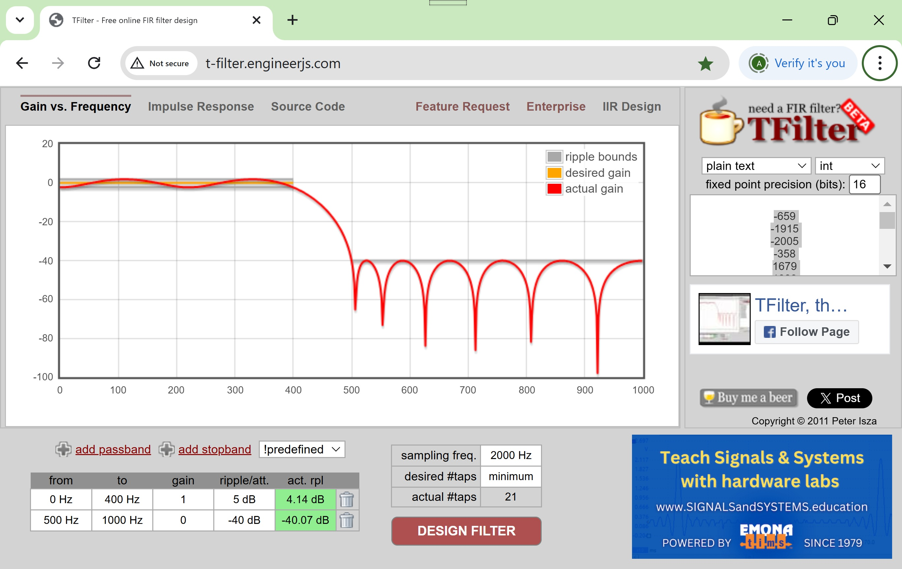
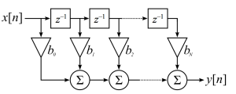

# Functionality
The low pass fir filter unit applies a 21 tap FIR filter to the incoming data.
The coefficients are designed for 2000Hz, passing through 0 to 400Hz, filter 500Hz to 1KHz per T-Filter website

 
FIR filter is implemented in VHDL as per picture Wikipedia FIR web-page:

# Interface

Besides clock and reset, this unit has the following ports:
* Inputs:
  * data_input (AXI-S slave to Avalon-ST interface, ADC value in 2's complement)
* Outputs:
  * data_output (Avalon-ST interface to AXI-S Master, ADC value in 2's complement)

# data format

## Input 16 bits
|Beat|Data|
|----|-------|
|1|sensor type|
|2|(15:0): scan count lsb|
|3|(15:0): scan count msb|
|4|(15:0): sample 1 (2's complement) |
|...|...|
|N+3|(15:0): sample N (2's complement)|
|N+4|error bits|

## Output 16 bits
|Beat|Data|
|----|-------|
|1|sensor type|
|2|(15:0): scan count lsb|
|3|(15:0): scan count msb|
|4|(15:0): filtered 1 (2's complement)|
|...|...|
|N+3|(15:0): filtered N (2's complement)|
|N+4|error bits|

Error bits from fir filter are reserved for future use.

# Design & Implementation
The top unit controls the parsing of the input data packet and the outgoing data packet.
The control part of the unit is implemented as a state machine, and the filter calculation is performed in fir_lowpass

## Implementation details
The control functionality is implemented in the control_p process using a state machine with the following states.
You can find the description of the state machine [here](@ref control).
\dot
digraph G {
  node [shape="box"];

  control_idle
  forward_header
  proc_fir_data
  wait_fir_end
  send_error_word

  control_idle -> forward_header [label="new packet and output ready"];
  forward_header -> proc_fir_data [label="3 header words forwarded"];
  proc_fir_data -> wait_fir_end [label="data written to filter"];
  wait_fir_end -> send_error_word [label="data empty out from filter"];
  send_error_word -> control_idle;
}
\enddot

The filter functionality is implemented in fir_lowpass; you can find a description [here](@ref filter-calculation).
Depending on the filter sum and coeff length value, the output is truncated to match the output data width.
NOTE that the internal variables are reset only with 'reset' input, so at the beginning of each scan the first
values clear with zeros. This behaviour is expected for FIR filter that signals eveually return to zero.

