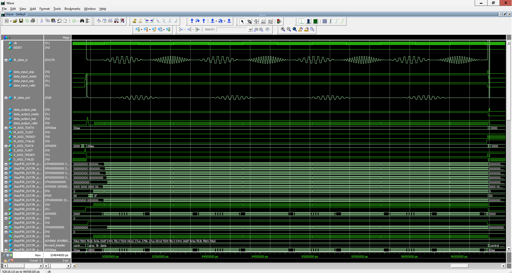

# Testbench
## Filtered result

### Reference model tests
The following tests use files for stimuli and response data. The files were generated by a reference model written in C.

1. Test sweeping low and high freqency to test the band of low pass filter.
  - Input signal:
    - 333KHz wavelet, 666KHz wavelet with mixture of higher frequency wavelet for 10 packets.
  - Expected result: 333KHz wavelet passes through, 666KHz wavelet filtered, staring at packet 6 counting from packet 0, in all cases match c model.
\n
